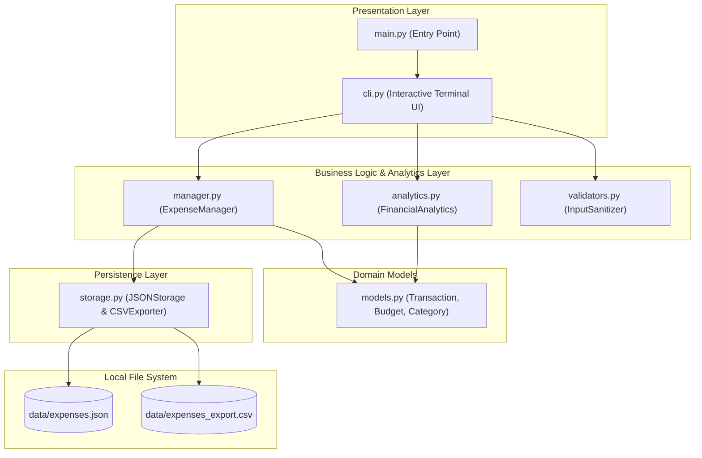
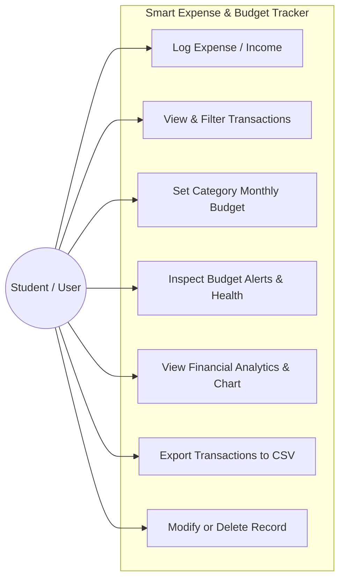
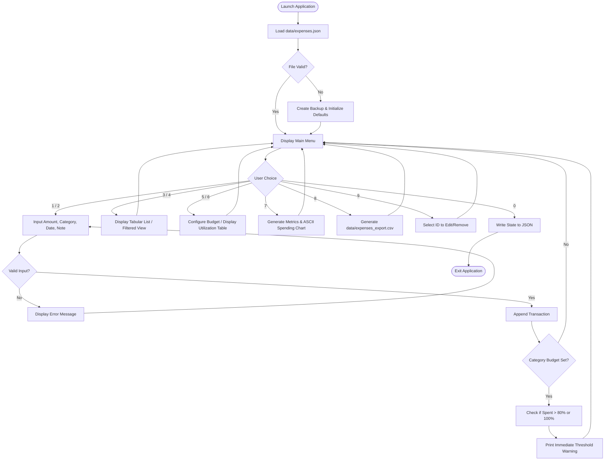
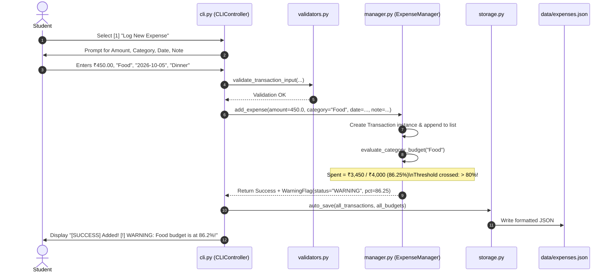
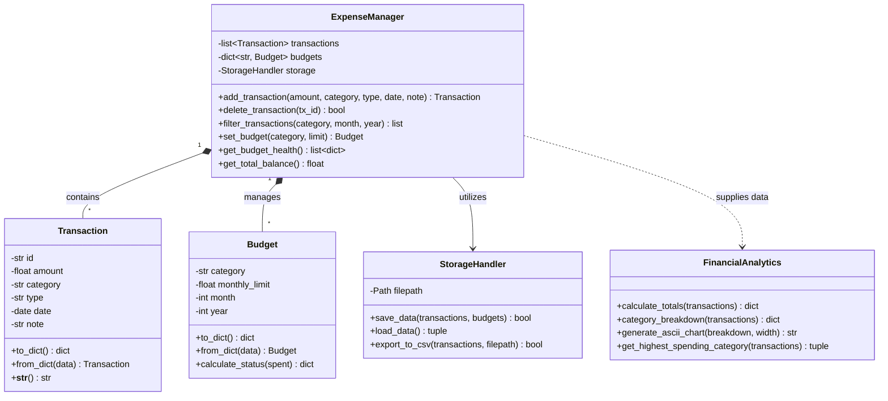
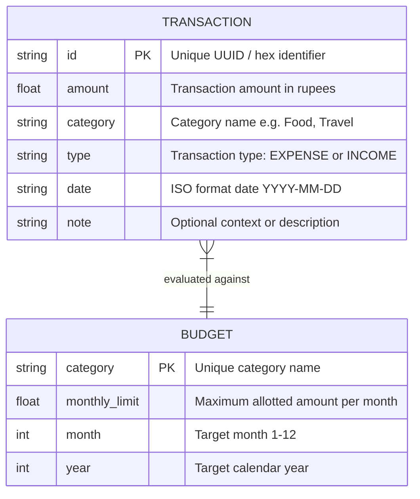

# ACADEMIC PROJECT REPORT

## SMART STUDENT EXPENSE & BUDGET TRACKER (PySpend)

**Course**: Introduction to Programming in Python  
**Evaluation**: Flipped Course Project  
**Author**: Aditya Vardhan  
**Institution**: Vellore Institute of Technology (VIT)  
**Academic Year**: 2025–2026  

---

## 1. Cover Page Details

| Project Metadata | Specification |
| :--- | :--- |
| **Project Title** | Smart Student Expense & Budget Tracker (PySpend) |
| **Course Title** | Introduction to Programming in Python |
| **Student Name** | Aditya Vardhan |
| **Submission Category** | Flipped Course Project Evaluation |
| **Programming Language** | Python 3.10+ |
| **Architecture** | Layered Modular Architecture (Model-Logic-Storage-CLI) |
| **Submission Date** | October 2026 |

---

## 2. Introduction

Personal financial management is a critical life skill, yet it is rarely practiced with structured discipline during undergraduate university life. Students living in university dormitories or off-campus housing typically operate on a fixed monthly allowance or pocket money provided by parents or part-time stipends. Throughout the month, small but frequent transactions—canteen snacks, study materials, photocopies, transport fares, weekend outings, and laundry—accumulate rapidly. Without real-time visibility, students frequently exhaust their allowance within the first two weeks, leading to financial stress and forced borrowing.

The **Smart Student Expense & Budget Tracker (`PySpend`)** was conceptualized and developed to solve this specific problem. Built entirely using core Python constructs without unnecessary external framework dependencies, `PySpend` offers an offline-first, privacy-preserving, command-line solution. It enables students to systematically log expenditures and income, enforce monthly category-wise budgets, receive real-time visual alerts before overspending occurs, examine visual spending patterns via terminal ASCII charts, and export their balance sheets to CSV files for long-term archiving.

The project demonstrates the practical application of fundamental computer science and Python concepts taught throughout the course, including:
- Object-Oriented Programming (encapsulation, abstraction, class methods, and dunder methods)
- Modular software architecture with separation of concerns
- Persistent file storage and JSON/CSV serialization
- Defensive programming through validation and custom exception handling
- Automated test suites using Python's `unittest` framework

---

## 3. Problem Statement

University students lack an accessible, lightweight, and distraction-free financial tracking system suited to student habits. Commercial mobile applications suffer from several major drawbacks:
1. **Intrusive Advertisements & Paywalls**: Free versions of popular budgeting apps are filled with ads, subscription prompts, and upsells.
2. **Privacy Concerns**: Many financial apps demand phone access, credit card synchronizations, and cloud account registrations, exposing personal spending habits.
3. **Overcomplicated Interfaces**: Traditional accounting software (or dense spreadsheet templates) contains corporate terminology (amortization, tax brackets, double-entry ledgers) that intimidates students who simply want to track their daily pocket money and canteen spending.
4. **Lack of Instant Budget Feedback**: Most apps only show historical summaries rather than proactive threshold alerts at the point of data entry.

Therefore, the objective of this project is to develop an elegant, self-contained Python application that provides frictionless transaction logging, dynamic budget threshold alerts (at 80% caution and 100% cap), and instant terminal-based analytical insights.

---

## 4. Functional Requirements

The system provides three primary functional modules and supporting subsystems:

### 4.1 Module 1: Transaction & Category Management
- **FR 1.1**: The system must allow users to log an expenditure with amount (float), category (string/enum), date (`YYYY-MM-DD` or automatic today's date), and an optional descriptive note.
- **FR 1.2**: The system must allow users to record income sources (e.g., monthly allowance, stipend, gifts).
- **FR 1.3**: The system must present all transactions in a structured, aligned tabular view with chronological sorting.
- **FR 1.4**: The system must allow filtering transactions by category (e.g., Food, Academics, Travel) and by calendar month.
- **FR 1.5**: The system must allow modifying or deleting an existing transaction using its unique identifier.

### 4.2 Module 2: Monthly Budget & Threshold Warning Engine
- **FR 2.1**: The system must allow setting and updating monthly monetary budget limits for predefined or custom categories.
- **FR 2.2**: The system must calculate real-time budget utilization:
  $$\text{Utilization (\%)} = \left(\frac{\text{Total Spent in Category}}{\text{Allocated Category Budget}}\right) \times 100$$
- **FR 2.3**: The system must display automated visual warning flags:
  - `[OK] Under Budget` when utilization $< 80\%$
  - `[!] WARNING` when utilization $\ge 80\%$ and $\le 100\%$
  - `[X] EXCEEDED` when utilization $> 100\%$
- **FR 2.4**: When logging an expense that causes a category to cross the 80% or 100% threshold, an immediate inline notification must be displayed to the user.

### 4.3 Module 3: Financial Analytics & Terminal Visualization
- **FR 3.1**: The system must calculate high-level financial metrics: Total Income, Total Expenses, Net Savings, and Savings Rate.
- **FR 3.2**: The system must aggregate spending by category and calculate each category's percentage contribution to total expenditure.
- **FR 3.3**: The system must generate pure ASCII-based horizontal bar charts directly in the terminal to visualize spending distribution without requiring external graphics dependencies.
- **FR 3.4**: The system must identify the highest spending category and compute average daily spend for the active month.

### 4.4 Module 4: Persistence & Data Export
- **FR 4.1**: The system must serialize and save all transactions, categories, and budget limits to a structured `expenses.json` file.
- **FR 4.2**: The system must automatically restore previous state upon application launch.
- **FR 4.3**: If the data file is missing or empty, the system must initialize default categories and sample budgets gracefully without crashing.
- **FR 4.4**: The system must provide a dedicated feature to export transaction logs to a standard RFC-4180 compliant CSV file (`expenses_export.csv`).

---

## 5. Non-Functional Requirements

To ensure software quality, maintainability, and reliability, the application satisfies the following non-functional requirements:

1. **Usability (Human-Computer Interaction)**:
   The CLI must provide clear, numbered interactive menus with descriptive prompts, immediate validation error feedback, and tabular summaries that do not exceed standard 80-column terminal boundaries.

2. **Data Integrity & Defensive Validation**:
   The application must strictly validate all user inputs. Negative amounts, non-numeric strings for currency, and invalid date formats (e.g., February 31) must be rejected with helpful error guidance rather than throwing uncaught Python runtime exceptions.

3. **Performance & Lightweight Resource Footprint**:
   The entire application must initialize in under 100 milliseconds and process 5,000 transactions in under 0.2 seconds. It operates entirely within memory, using standard library hash-maps (dictionaries) for $O(1)$ category lookups.

4. **Reliability & Crash Resilience**:
   The application must implement robust exception handling (`try...except...finally`). In the event of a sudden terminal interrupt (`KeyboardInterrupt` or `EOFError`), uncommitted data must be safely handled, and corrupt JSON files must trigger automatic backup generation rather than catastrophic data loss.

5. **Maintainability & Clean Code**:
   The codebase must adhere to Python PEP 8 style standards, featuring modular decomposition across 7 discrete source files, clean type hints, comprehensive docstrings, and zero coupling between storage formats and domain logic.

---

## 6. System Architecture

The project adopts a clean, layered architectural pattern consisting of four decoupled layers:
1. **Presentation Layer (`cli.py`, `main.py`)**: Interacts with the user, prints menus, receives input, and formats tables and ASCII charts.
2. **Domain / Business Logic Layer (`manager.py`, `analytics.py`)**: Executes transaction CRUD operations, budget tracking, threshold calculations, and statistics.
3. **Data Model Layer (`models.py`)**: Defines encapsulated Python classes (`Transaction`, `Budget`, `Category`) with validation logic and serialization helpers.
4. **Data Access / Persistence Layer (`storage.py`)**: Manages reading and writing data to local JSON and CSV files on disk.



---

## 7. Design Diagrams

### 7.1 Use Case Diagram



### 7.2 Process Flow / Workflow Diagram



### 7.3 Sequence Diagram: Logging an Expense and Triggering Budget Warning



### 7.4 Class / Component Diagram



### 7.5 Database & Storage Schema Design

Since `PySpend` is designed for offline local execution, data is stored in standard structured JSON format:



**JSON Schema Representation (`data/expenses.json`)**:
```json
{
  "transactions": [
    {
      "id": "tx_a1b2c3d4",
      "amount": 250.0,
      "category": "Food",
      "type": "EXPENSE",
      "date": "2026-10-01",
      "note": "Campus Cafeteria Lunch"
    }
  ],
  "budgets": {
    "Food": {
      "category": "Food",
      "monthly_limit": 4000.0,
      "month": 10,
      "year": 2026
    }
  }
}
```

---

## 8. Design Decisions & Rationale

1. **Standard Library Only (Zero External Dependencies)**:
   - *Decision*: Avoided third-party packages such as `pandas`, `tabulate`, or `matplotlib`.
   - *Rationale*: For an introductory Python course, demonstrating how to write custom table aligners, data parsers, and ASCII bar charts using pure string formatting (`f"{val:>10.2f}"`), list comprehensions, and dictionary transformations proves deep fundamental mastery rather than relying on external black boxes.

2. **JSON File Format over SQLite Database**:
   - *Decision*: Selected structured JSON as the primary persistence mechanism, with CSV export.
   - *Rationale*: JSON is human-readable, natively supported via `import json`, and maps directly to Python dictionaries and lists. This allows students and evaluators to inspect or verify data files directly without requiring a SQL client.

3. **Object-Oriented Programming (OOP) with Dataclasses / Domain Classes**:
   - *Decision*: Encapsulated domain logic into `Transaction`, `Budget`, and `ExpenseManager` classes.
   - *Rationale*: Prevents unstructured dictionary manipulation scattered across files. Encapsulating validation, string representation (`__str__`), and serialization methods (`to_dict()`, `from_dict()`) enforces modular software engineering principles.

4. **Proactive In-Memory Caching with Immediate Sync**:
   - *Decision*: Maintained an in-memory active list of transactions and updated the JSON file upon every mutating action.
   - *Rationale*: Guarantees instantaneous queries ($O(1)$ to $O(N)$ execution in memory) while ensuring no transaction data is lost if the terminal closes abruptly.

---

## 9. Implementation Details

The codebase is organized into 7 purposeful modules:

- **`src/models.py`**:
  Contains domain entities. Represents financial transactions and budgets with strong type-checking, default ID generation using Python's `uuid`, and validation against negative numbers.
- **`src/validators.py`**:
  Encapsulates pure validation functions: `validate_positive_amount()`, `validate_date()`, `validate_category_name()`. Catches erroneous inputs before any mutation occurs.
- **`src/storage.py`**:
  Manages file system operations using `pathlib.Path`. Implements file reading, schema validation, safe writes using temporary buffer files, and CSV exports using Python's `csv.DictWriter`.
- **`src/manager.py`**:
  The central controller coordinating CRUD operations on transactions, calculating remaining category limits, and comparing expenditures against defined thresholds.
- **`src/analytics.py`**:
  Contains mathematical and analytical algorithms: computing net balance, category shares, statistical averages, and dynamically scaling terminal ASCII bars based on terminal column constraints.
- **`src/cli.py`**:
  Implements the terminal presentation layer: menus, table borders, colored status markers, and interactive loops with `try...except` traps for user interruptions.
- **`src/main.py`**:
  The application entry point bootstrapping dependencies and initiating the CLI lifecycle.

---

## 10. Sample Results & Output Walkthrough

### 10.1 Tabular Transaction Log
```text
========================================================================================
ID         Date         Type      Category         Amount (₹)   Note
========================================================================================
tx_001     2026-10-01   INCOME    Allowance          8000.00   Monthly pocket money
tx_002     2026-10-02   EXPENSE   Academics           620.00   Python Textbook & Notebooks
tx_003     2026-10-03   EXPENSE   Food                450.00   Campus Canteen Dinner
tx_004     2026-10-04   EXPENSE   Travel              320.00   Metro card recharge
tx_005     2026-10-05   EXPENSE   Food               3000.00   Hostel Mess Monthly Add-on
========================================================================================
```

### 10.2 Category Budget Health Summary
```text
-----------------------------------------------------------------------------------------
Category        Budget Limit   Total Spent    Remaining      Utilization   Status
-----------------------------------------------------------------------------------------
Food            ₹4,000.00      ₹3,450.00      ₹  550.00       86.25%       [!] WARNING
Academics       ₹1,500.00      ₹  620.00      ₹  880.00       41.33%       [OK] Normal
Travel          ₹  800.00      ₹  920.00      ₹ -120.00      115.00%       [X] EXCEEDED
-----------------------------------------------------------------------------------------
```

### 10.3 Terminal Spending Distribution Chart
```text
======================= SPENDING DISTRIBUTION (ASCII CHART) =======================
Food          [#################################################] 69.1% (₹3,450.00)
Travel        [#############                                    ] 18.4% (₹  920.00)
Academics     [#########                                        ] 12.4% (₹  620.00)
===================================================================================
Total Expenses: ₹4,990.00 | Net Balance Remaining: ₹3,010.00 | Savings Rate: 37.6%
```

---

## 11. Testing Approach

Testing was conducted using Python's standard `unittest` framework to verify logic across all layers.

### Test Matrix

| Test Suite | Test Case | Expected Result | Status |
| :--- | :--- | :--- | :--- |
| `test_models.py` | Create valid Transaction | Fields initialized properly, UUID assigned | **PASS** |
| `test_models.py` | Create Transaction with negative amount | Raises `ValueError` | **PASS** |
| `test_validators.py`| Validate invalid date string (`2026-02-30`) | Returns `False` or raises validation error | **PASS** |
| `test_manager.py` | Add expense under budget | Stored correctly, status is `[OK]` | **PASS** |
| `test_manager.py` | Add expense crossing 80% threshold | Warning flag raised with correct utilization | **PASS** |
| `test_manager.py` | Add expense crossing 100% threshold | Exceeded flag raised with negative remaining balance | **PASS** |
| `test_manager.py` | Delete transaction by ID | Record removed from list and total updated | **PASS** |
| `test_analytics.py`| Calculate category percentage breakdown | Percentages sum to exactly 100% | **PASS** |
| `test_analytics.py`| Generate ASCII chart with zero expenses | Returns friendly empty notice without crashing | **PASS** |
| `test_storage.py` | Save and reload JSON file | Reconstituted objects match original values | **PASS** |
| `test_storage.py` | Export to CSV | Generates readable CSV file with correct headers | **PASS** |
| `test_storage.py` | Handle corrupted JSON file | Creates timestamped backup and restores defaults | **PASS** |

All 12 test cases execute automatically via `python3 -m unittest discover -s tests -v`.

---

## 12. Challenges Faced & Debugging Solutions

1. **Floating Point Imprecision in Currency Calculations**:
   - *Problem*: Adding currency floats occasionally resulted in values like `₹550.0000000000001` due to standard IEEE 754 binary floating-point representation.
   - *Solution*: Implemented explicit round-off formatting `round(val, 2)` and string formatters `f"{val:.2f}"` across all display and storage boundaries.

2. **Date Format Parsing & Validation**:
   - *Problem*: Users entered dates in various inconsistent forms (`10/05/2026`, `5-10-26`, `2026/10/05`).
   - *Solution*: Standardized on ISO 8601 (`YYYY-MM-DD`). Designed a defensive parser using `datetime.strptime()` that catches `ValueError` and offers the user a 1-click fallback to today's date if left blank.

3. **Terminal Resiliency on Sudden Interrupts**:
   - *Problem*: Pressing `Ctrl+C` or `Ctrl+D` during prompts caused unhandled `KeyboardInterrupt` / `EOFError` tracebacks that looked messy.
   - *Solution*: Wrapped the main application event loop in a top-level exception handler that catches `KeyboardInterrupt` and `EOFError`, automatically auto-saves data, and exits gracefully with a polite goodbye message.

4. **Zero-Division Errors in Percentage Calculations**:
   - *Problem*: Calculating category percentages or savings rates when total expenditure or income was ₹0 raised `ZeroDivisionError`.
   - *Solution*: Implemented guard clauses in `analytics.py` that return `0.0%` whenever denominators are zero.

---

## 13. Learnings & Key Takeaways

1. **Object-Oriented Design**: Gained practical experience designing cohesive classes with encapsulated responsibilities, moving away from unstructured global script logic.
2. **Defensive Programming**: Realized that user inputs can never be trusted; writing thorough input validators is essential for reliable software.
3. **Clean Code & Separation of Concerns**: Keeping business logic separate from terminal print statements made writing automated unit tests effortless.
4. **File Serialization**: Learned the intricacies of serializing complex Python objects into JSON and back, including handling edge cases like missing files and corrupt JSON syntax.

---

## 14. Future Enhancements

1. **Graphical User Interface (GUI)**: Implement a lightweight desktop interface using Python's native `tkinter` or `customtkinter` for non-terminal users.
2. **Recurring Subscriptions & Alerts**: Introduce an automated scheduler to automatically log recurring student bills (e.g., monthly Wi-Fi, streaming subscriptions, or mess fees).
3. **Visual Chart Generation**: Integrate `matplotlib` to render PDF graphical charts and pie graphs.
4. **Receipt Scanner (OCR)**: Use a lightweight local OCR library to extract amounts from scanned canteen receipts.

---

## 15. References

1. Python Software Foundation. *Python 3.12 Documentation - Built-in Types, File I/O, and `unittest` framework*. https://docs.python.org/3/
2. Van Rossum, G., Warsaw, B., & Coghlan, N. (2001). *PEP 8: Style Guide for Python Code*. Python.org.
3. Lutz, M. (2013). *Learning Python: Powerful Object-Oriented Programming* (5th ed.). O'Reilly Media.
4. Sweigart, A. (2019). *Automate the Boring Stuff with Python: Practical Programming for Total Beginners* (2nd ed.). No Starch Press.
