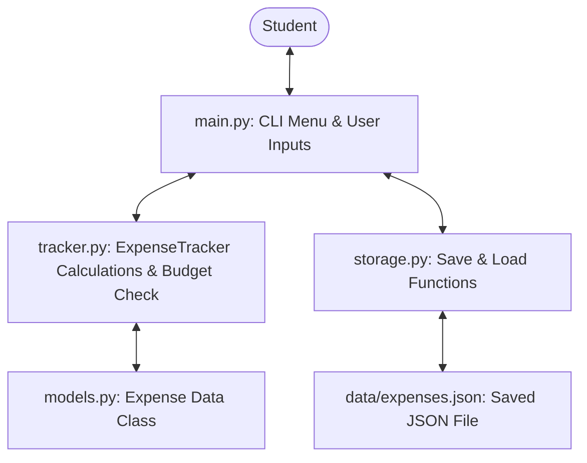
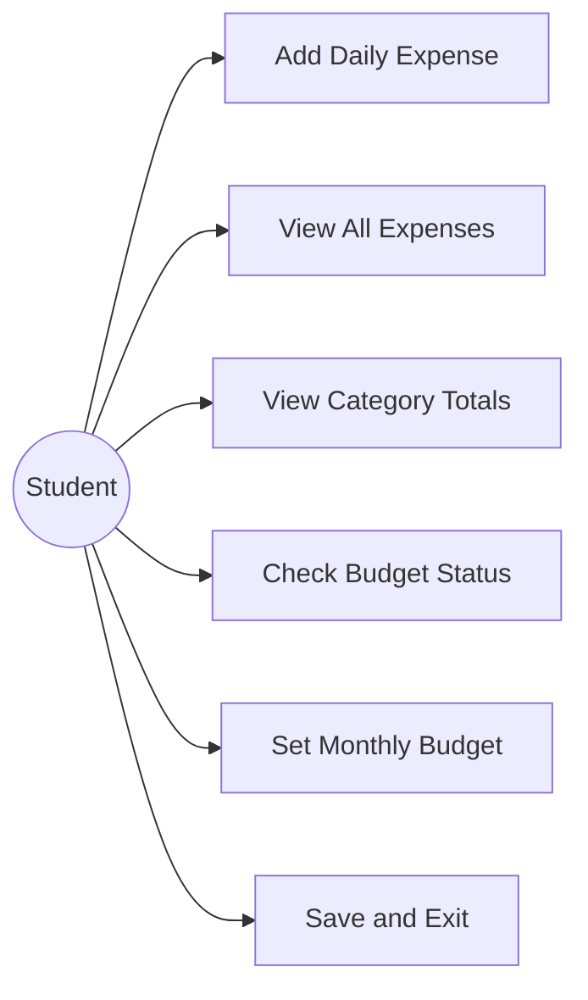
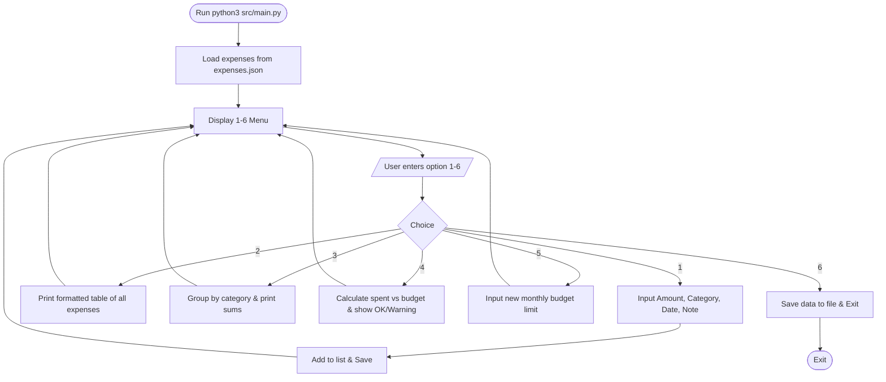
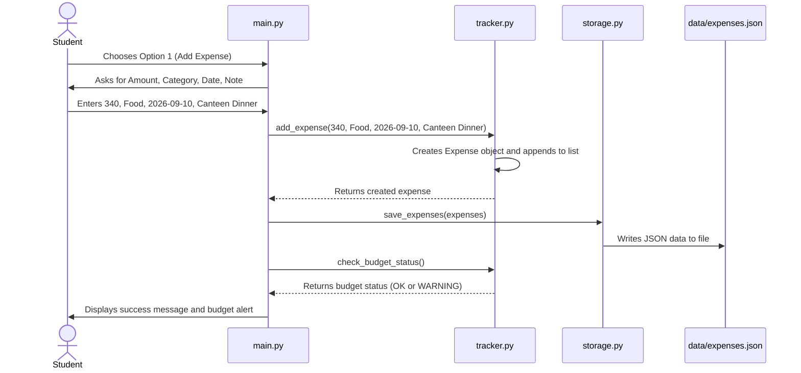
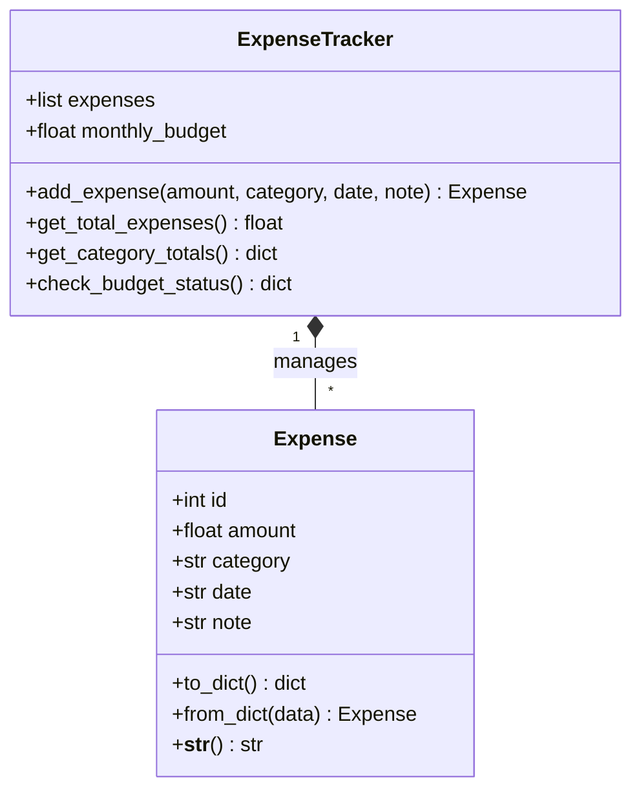

# PROJECT REPORT

## STUDENT EXPENSE TRACKER

**Course**: Introduction to Programming in Python  
**Evaluation**: Flipped Course Project  
**Student Name**: Aditya Vardhan  
**Institution**: Vellore Institute of Technology (VIT)  

---

## 1. Cover Page

- **Project Title**: Student Expense Tracker
- **Subject**: Introduction to Programming in Python
- **Student Name**: Aditya Vardhan
- **Tools Used**: Python 3.10+, VS Code, Git
- **Standard Libraries**: `json`, `os`, `sys`, `unittest`
- **Submission Date**: October 2026

---

## 2. Introduction

As a college student living away from home, managing daily pocket money is tricky. I often found myself spending small sums every day on canteen snacks, Gazebo meals, photocopies of notes, auto fares to the railway station, and stationery. Individually, these expenses seem small, but by the third week of the month, my bank balance was almost zero, and I had no clear idea where all the money went.

I decided to build the **Student Expense Tracker** to solve this personal problem. Instead of using clunky mobile apps full of ads and sign-up screens, I wanted a fast, lightweight command-line Python program that I can open in my terminal, log what I spent in 5 seconds, see how much I have spent in each category, and know whether I am staying inside my monthly budget.

This project gave me a practical chance to apply the core Python topics I learned during the course:
- Building classes with methods and constructors (`__init__`, `to_dict`)
- Handling lists, dictionaries, and string formatting
- Saving and loading data from local JSON files
- Catching user errors using `try-except` blocks
- Writing unit tests using Python's built-in `unittest` module

---

## 3. Problem Statement

Most college students get a fixed allowance from parents each month. The main problems students face with money management are:
1. **No tracking of micro-expenses**: Spending Rs. 30 on tea or Rs. 50 on printouts goes unnoticed until money runs out.
2. **Annoying mobile apps**: Most commercial finance apps require account creation, push notifications, bank SMS permissions, and an active internet connection.
3. **Overcomplicated tools**: Using Excel sheets or accounting software with balance sheets and ledger columns is intimidating and too slow for a student who just wants to log lunch.

The goal of this project was to make a fast, offline, and clean Python tool where a student can record daily spending, view category totals, and get an immediate alert when spending reaches 80% or crosses 100% of their monthly budget limit.

---

## 4. Functional Requirements

I divided the application into these core functional capabilities:
1. **Add Expense**: The user can record an expense by typing the amount, category (Food, Travel, Books, Mess, etc.), date, and an optional note.
2. **View All Expenses**: Displays all recorded transactions in a clean table showing ID, date, category, amount, note, and the overall total.
3. **Category Summary**: Calculates how much money was spent under each category so the user knows their biggest spending area.
4. **Monthly Budget Checking**: Compares total spending against a preset budget (e.g. Rs. 5000) and displays:
   - `[OK]` if spending is below 80%
   - `[WARNING]` if spending is between 80% and 100%
   - `[EXCEEDED]` if spending goes beyond the budget limit
5. **Adjust Monthly Budget**: Allows changing the budget limit anytime.
6. **Data Persistence**: Automatically reads from and writes to `data/expenses.json` so data remains safe after closing the terminal.

---

## 5. Non-Functional Requirements

1. **Simplicity and Usability**: The program uses a clean numbered terminal menu (1 to 6). Prompts are short and easy to understand.
2. **Input Validation**: If a user enters text like "abc" or negative numbers for money, the program displays a friendly error message instead of crashing with a `ValueError`.
3. **Reliability**: All expenses are stored in a local JSON file. If the file doesn't exist yet, the program creates it without throwing an error.
4. **Clean Code & Maintainability**: The code is separated into small files (`models.py`, `tracker.py`, `storage.py`, `main.py`). Each file handles one specific job, making it easy to read and debug.

---

## 6. System Architecture

I organized the project into four simple layers:



- **`main.py`** takes input from the user and prints results.
- **`tracker.py`** handles the math (sums, category grouping, percentage used).
- **`models.py`** defines what an Expense object looks like.
- **`storage.py`** talks to the hard drive to read and write the JSON file.

---

## 7. Design Diagrams

### 7.1 Use Case Diagram



### 7.2 Workflow Diagram



### 7.3 Sequence Diagram: Adding an Expense



### 7.4 Class Diagram



### 7.5 Database & Storage Design

Instead of setting up a heavy SQL database, I used a simple JSON file (`data/expenses.json`). Each expense is stored as an object inside a list:

```json
[
  {
    "id": 1,
    "amount": 750.0,
    "category": "Books",
    "date": "2026-09-05",
    "note": "Python Reference Book"
  },
  {
    "id": 2,
    "amount": 340.0,
    "category": "Food",
    "date": "2026-09-10",
    "note": "Campus Canteen Dinner"
  }
]
```

---

## 8. Design Decisions & Rationale

1. **Why Python Standard Library Only?**
   I deliberately avoided third-party packages like `pandas`, `tabulate`, or `matplotlib`. Using only built-in modules (`json`, `os`, `sys`, `unittest`) ensures that anyone can download the project and run it right away without needing `pip install`. It also demonstrates that I understand core Python fundamentals like dictionary manipulation and string formatting.

2. **Why JSON instead of SQLite?**
   For a student tracking around 50 to 100 expenses a month, an SQL database is unnecessary overkill. JSON is human-readable, easy to inspect in VS Code, and converts naturally into Python dictionaries and lists.

3. **Why Separate into 4 Files?**
   Putting everything into a single 300-line file makes it hard to test and read. By separating the data model (`models.py`), storage operations (`storage.py`), business logic (`tracker.py`), and user interface (`main.py`), I could write unit tests for the tracking logic without triggering any terminal prompts.

---

## 9. Implementation Details

Here is how each file in `src/` works:

- **`models.py`**:
  Contains the `Expense` class. It stores the expense details (`id`, `amount`, `category`, `date`, `note`). It has a `to_dict()` method so the object can be serialized to JSON, a `from_dict()` classmethod to recreate objects when loading from disk, and a `__str__()` method for printing.
- **`tracker.py`**:
  Contains the `ExpenseTracker` class. It manages the `expenses` list and contains the core calculations:
  - `get_total_expenses()`: Uses Python's `sum()` function to calculate total spending.
  - `get_category_totals()`: Iterates through all expenses and builds a dictionary of category totals using `totals.get(cat, 0.0) + exp.amount`.
  - `check_budget_status()`: Computes percentage used and flags whether spending is normal (`OK`), close to the limit (`WARNING`), or exceeded (`EXCEEDED`).
- **`storage.py`**:
  Contains two functions: `load_expenses()` and `save_expenses()`. It handles file paths safely using `os.path` and catches missing or corrupted files with `try-except`.
- **`main.py`**:
  Runs an interactive `while True` loop with a menu (1 to 6). It takes inputs from the user, calls methods on `ExpenseTracker`, and prints clean, formatted output.

---

## 10. Sample Results & Terminal Output

### Main Menu & Checking Budget
```text
=============================================
      STUDENT EXPENSE TRACKER
=============================================
1. Add New Expense
2. View All Expenses
3. View Category Summary
4. Check Monthly Budget Status
5. Set Monthly Budget
6. Save and Exit
---------------------------------------------
Enter choice (1-6): 4

--- BUDGET STATUS ---
  Monthly Budget : Rs. 5000.00
  Total Spent    : Rs. 4540.00
  Remaining      : Rs. 460.00
  Budget Used    : 90.8%
  Status         : [WARNING]
```

### Viewing All Expenses
```text
--- ALL EXPENSES ---
ID   Date         Category       Amount  Note
-------------------------------------------------------
1    2026-09-05   Books       Rs.  750.00  Python Book
2    2026-09-10   Food        Rs.  340.00  Canteen Dinner
3    2026-09-12   Travel      Rs.  500.00  Metro recharge
4    2026-09-18   Mess        Rs. 2500.00  Mess coupon
5    2026-09-22   Entertainment Rs.  450.00  Movie ticket
-------------------------------------------------------
Total Spent: Rs. 4540.00
```

---

## 11. Testing Approach

I wrote automated unit tests in `tests/test_tracker.py` using Python's built-in `unittest` library. Testing helped me verify that the calculations and budget checks work correctly without having to manually type inputs in the menu every time.

| Test Name | What It Tests | Expected Output | Status |
| :--- | :--- | :--- | :--- |
| `test_add_expense` | Adding an expense to tracker | Count increases to 1, attributes match input | **PASS** |
| `test_get_total_expenses` | Adding multiple expenses and summing | Returns exact sum (100 + 200 + 50 = 350) | **PASS** |
| `test_get_category_totals` | Grouping expenses by category | Food totals Rs. 250, Travel totals Rs. 80 | **PASS** |
| `test_budget_status_ok` | Spending well below monthly budget | Returns status `OK` with correct remaining balance | **PASS** |
| `test_budget_status_warning_and_exceeded` | Crossing 80% and 100% budget limit | Returns `WARNING` at 83% and `EXCEEDED` when over limit | **PASS** |

I ran the tests with this command:
```bash
python3 -m unittest discover -s tests -v
```
All 5 tests executed in less than 0.01 seconds with result `OK`.

---

## 12. Challenges Faced & Solutions

During development, I ran into a few practical issues that taught me a lot:

1. **Crashes on Invalid User Inputs**:
   - *Problem*: When asking the user for an amount, entering text like `"fifty"` or leaving it blank caused `float()` to crash with a `ValueError`.
   - *Solution*: I wrapped the input reading inside a `try-except ValueError` block. If invalid input is detected, the program prints a helpful message like `"[Error] Invalid amount! Please enter numeric digits."` and returns to the menu safely.

2. **KeyError While Grouping Categories**:
   - *Problem*: In `get_category_totals()`, accessing `totals[exp.category]` on a new category that wasn't in the dictionary yet threw a `KeyError`.
   - *Solution*: I used the dictionary `.get()` method: `totals[exp.category] = totals.get(exp.category, 0.0) + exp.amount`. If the category isn't there yet, it starts at `0.0`.

3. **Handling Empty JSON Files on First Run**:
   - *Problem*: If the user ran the program for the first time without an existing `expenses.json` file, `open()` failed with `FileNotFoundError`.
   - *Solution*: In `storage.py`, I checked `os.path.exists(filepath)` first. If the file doesn't exist, it simply returns an empty list `[]` instead of crashing.

---

## 13. Learnings & Key Takeaways

1. **Object-Oriented Programming**: Creating the `Expense` class helped me see how bundling data with methods makes code much cleaner than using loose dictionaries everywhere.
2. **File Handling in Python**: Learned how to serialize objects into JSON format with `json.dump()` and load them back with `json.load()`.
3. **Defensive Programming**: Realized that user input must always be validated so the program never crashes unexpectedly.
4. **Writing Tests**: Writing unit tests with `unittest` made me confident that my calculations and budget warnings worked accurately.

---

## 14. Future Enhancements

If I extend this project in the next semester, I would like to add:
1. A graphical interface (GUI) using `tkinter` with buttons and input fields.
2. An option to export the expense history to a `.csv` file so I can open it in Microsoft Excel.
3. A visual bar chart or pie chart of spending using `matplotlib`.

---

## 15. References

1. Python Software Foundation. *The Python Tutorial and Standard Library Reference (`json`, `unittest`)*. https://docs.python.org/3/
2. Al Sweigart. *Automate the Boring Stuff with Python*, 2nd Edition.
3. Course Lecture Notes and Lab Exercises on Object-Oriented Programming and File I/O.
