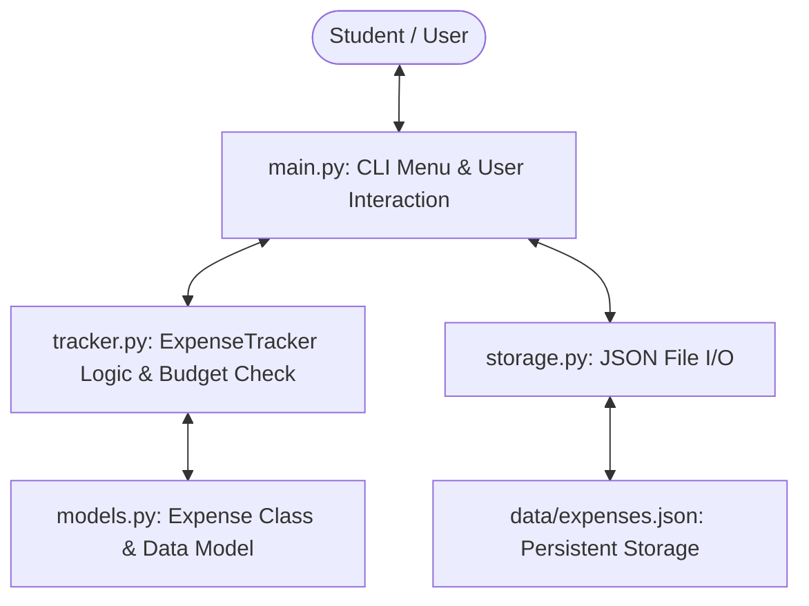
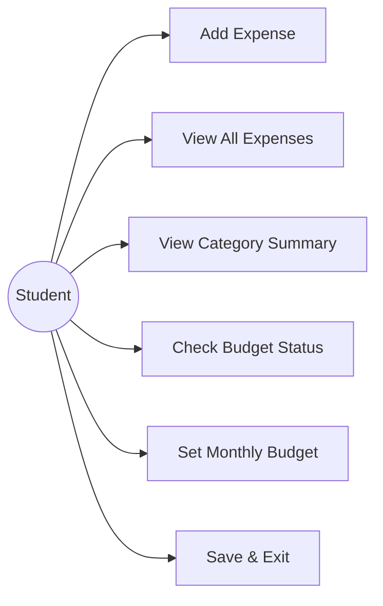
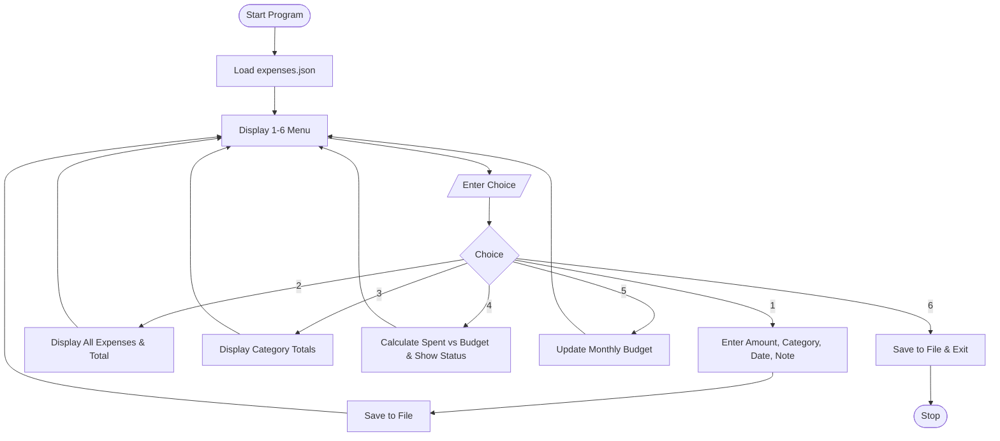
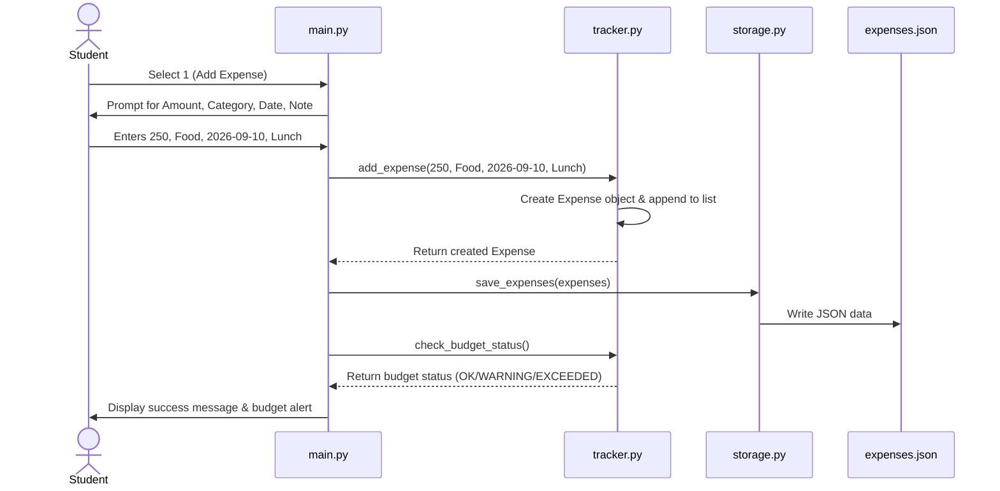

# ACADEMIC PROJECT REPORT

## STUDENT EXPENSE TRACKER

**Course**: Introduction to Programming in Python  
**Evaluation**: Flipped Course Project  
**Author**: Aditya Vardhan  
**Institution**: Vellore Institute of Technology (VIT)  

---

## 1. Cover Page

- **Project Title**: Student Expense Tracker
- **Subject**: Introduction to Programming in Python
- **Student Name**: Aditya Vardhan
- **Tools Used**: Python 3 (Standard Library: `json`, `os`, `sys`, `unittest`)
- **Submission Date**: October 2026

---

## 2. Introduction

Managing daily expenses is a routine challenge for college students living on campus or receiving a monthly allowance. Keeping track of food, books, travel, and hostel supplies manually or using memory often leads to running out of pocket money before the month ends.

The **Student Expense Tracker** is a lightweight, menu-driven Python application designed to help students record daily expenses, categorize their spending, view total expenditures, and receive automatic alerts when approaching or exceeding their monthly budget. It uses standard Python features such as classes, functions, file handling, and lists/dictionaries without requiring any third-party libraries.

---

## 3. Problem Statement

Most students do not track small daily expenditures like canteen snacks, auto-rickshaw rides, and photocopies. Commercial budget apps are often too complicated, require mobile account logins, show advertisements, and need internet access. 

This project aims to build an offline, simple, and clean command-line tool that lets students:
1. Quickly log daily expenses.
2. View spending categorized by type (Food, Books, Travel, etc.).
3. Monitor spending against a set monthly budget limit.
4. Keep all data safely stored in a local JSON file.

---

## 4. Functional Requirements

1. **Expense Recording**: Users can input an expense with an amount, category, date, and optional note.
2. **View Expenses**: The system lists all recorded transactions with ID, date, category, amount, and notes, along with the total sum.
3. **Category Breakdown**: The system calculates and displays the sum of money spent in each category.
4. **Budget Monitoring**: Users can set a monthly budget. The system checks spending percentage and displays `[OK]`, `[WARNING]` (when $\ge 80\%$), or `[EXCEEDED]` (when $> 100\%$).
5. **Data Storage**: All records are saved to and loaded from `data/expenses.json` automatically.

---

## 5. Non-Functional Requirements

1. **Usability**: Clean, numbered menu options with clear instructions and readable output formatting.
2. **Data Validation**: Protects against invalid inputs like negative numbers or non-numeric strings for amounts using `try-except` blocks.
3. **Reliability**: Saves data to a persistent JSON file so records are preserved even after closing the program.
4. **Maintainability**: Code is organized into small, modular files (`models.py`, `tracker.py`, `storage.py`, `main.py`) adhering to PEP 8 standards.

---

## 6. System Architecture

The application follows a simple modular architecture:



---

## 7. Design Diagrams

### 7.1 Use Case Diagram



### 7.2 Workflow Diagram



### 7.3 Sequence Diagram: Adding an Expense



### 7.4 Class Diagram


### 7.5 Storage Design

Data is stored as a list of JSON objects inside `data/expenses.json`:

```json
[
  {
    "id": 1,
    "amount": 250.0,
    "category": "Food",
    "date": "2026-09-10",
    "note": "Campus Canteen Lunch"
  }
]
```

---

## 8. Design Decisions & Rationale

- **Pure Standard Library**: Avoided external packages like `pandas` or `tabulate` so the code is easy to run on any computer with standard Python.
- **JSON File Format**: Chose JSON over SQLite because it is human-readable, lightweight, and directly converts to Python lists and dictionaries.
- **Separation of Logic and Interface**: Keeping calculations in `tracker.py` and input/output in `main.py` makes it simple to test functions independently.

---

## 9. Implementation Details

The project consists of 4 main source files:
- **`src/models.py`**: Defines the `Expense` class with attributes (`id`, `amount`, `category`, `date`, `note`), dictionary conversion methods, and a string representation.
- **`src/tracker.py`**: Contains `ExpenseTracker` which manages the list of expenses, calculates total spending, groups totals by category, and evaluates budget status.
- **`src/storage.py`**: Contains `load_expenses()` and `save_expenses()` using Python's `json` module.
- **`src/main.py`**: Implements the user menu loop, reads choices, prompts for inputs, and displays formatted summaries.

---

## 10. Sample Results

### Menu Screen & Adding an Expense
```text
=============================================
      STUDENT EXPENSE TRACKER
=============================================
1. Add New Expense
2. View All Expenses
3. View Category Summary
4. Check Monthly Budget Status
5. Set Monthly Budget
6. Save and Exit
---------------------------------------------
Enter choice (1-6): 1
Enter amount (Rs.): 340
Enter category: Food
Enter date (YYYY-MM-DD): 2026-09-10
Enter note (optional): Campus Canteen Dinner
[OK] Added Expense #2: Rs. 340.00 for 'Food'
```

### Budget Check Output
```text
--- BUDGET STATUS ---
  Monthly Budget : Rs. 5000.00
  Total Spent    : Rs. 4540.00
  Remaining      : Rs. 460.00
  Budget Used    : 90.8%
  Status         : [WARNING]
```

---

## 11. Testing Approach

Unit testing was performed using Python's built-in `unittest` module in `tests/test_tracker.py`:

| Test Name | Test Goal | Expected Result | Status |
| :--- | :--- | :--- | :--- |
| `test_add_expense` | Add a single expense | Expense added to list, correct ID and amount | **PASS** |
| `test_get_total_expenses` | Sum multiple expenses | Total matches arithmetic sum | **PASS** |
| `test_get_category_totals` | Group expenses by category | Category amounts calculated correctly | **PASS** |
| `test_budget_status_ok` | Spend under 80% of budget | Status returns `OK` | **PASS** |
| `test_budget_status_warning_and_exceeded` | Cross 80% and 100% budget | Status returns `WARNING` and `EXCEEDED` | **PASS** |

All tests pass by running:
```bash
python3 -m unittest discover -s tests -v
```

---

## 12. Challenges Faced

1. **Handling Non-Numeric Input**: If a user enters letters instead of numbers for amount, Python raises a `ValueError`. This was resolved by wrapping `float(input(...))` in a `try-except` block.
2. **Calculating Category Totals**: Iterating over expenses to group them by category was solved cleanly using a Python dictionary (`totals[cat] = totals.get(cat, 0.0) + amount`).
3. **Empty Data File**: Handled missing or empty JSON files gracefully by returning an empty list rather than crashing with `FileNotFoundError`.

---

## 13. Learnings & Key Takeaways

- Practical understanding of Object-Oriented Programming (OOP) in Python using classes and methods.
- Hands-on experience with file input/output and JSON serialization.
- Organizing code into separate modules for better clarity and easier debugging.
- Writing automated test cases with `unittest`.

---

## 14. Future Enhancements

1. Add a graphical user interface (GUI) using `tkinter`.
2. Add an export option to save reports as a CSV spreadsheet.
3. Allow filtering expenses by date range.

---

## 15. References

1. Python Official Documentation: *The Python Standard Library (json, unittest)* - https://docs.python.org/3/
2. Sweigart, Al. *Automate the Boring Stuff with Python*, 2nd Edition.
